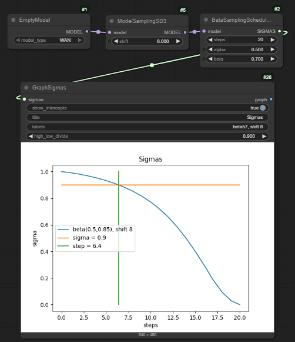

# Sigmas

A collection of nodes I put together to try to understand sigmas and scheduling a bit better.

They can be found under `quicknodes/sigmas`.

## What are sigmas anyway?

Sigma is a measure of how much noise there is left in an image as you go through the denoising process. 

`sigma=0.0` means that there is no noise. For the purposes of this explanation, we'll say that `sigma=1.0` is pure noise. 
(Side note - some models, such as SDXL, use `sigma=14.1` for pure noise, for reasons that aren't clear to me).

The scheduler creates a list of `sigmas` which tell the denoising process how quickly the noise should be removed.
A simple list might look like this: `[1.0, 0.5, 0.2, 0.0]`. This would tell the denoising process that we start
with `1.0` noise, the first step reduces it to `0.5`, the second to `0.2` and the third to `0.0`. 

Notice that the list of sigmas is one longer than the number of steps.

If you are doing img2img, `sigma` will start at the value you choose for `denoise`(and this amount of noise will be
added to the image at the start). Essentially you are just starting part way through the process.

## Why does this matter?

Imagine someone walking towards you on a foggy day - the fog is the noise, the person is the image.
As they approach, the noise gets less, allowing you to start to see them.

At first, when the noise is still quite high, you can only make out the rough shape of the figure.
As the noise gets less, you start to see major features - arms and legs, perhaps. 
As they get closer still, those major features don't change much, but more detail emerges.

The broad features of an image are determined during the early steps, when `sigma` is still high;
the fine details are determined when `sigma` is low.

So if you want to improve details, you want the denoising process to take more care (by taking more, smaller, steps)
when `sigma` is relatively small; if you are wanting to improve broad features, you want more steps while `sigma` is high.

The nodes in this pack help to visualise the `sigmas` created by different schedulers, and also help you manipulate them.

The `SamplerCustom` and `SamplerCustomAdvanced` nodes allow you to specify the `sigmas` that you want to use.

# Visualising Sigmas

Probably the most useful node in this pack is `GraphSigmas`. Plug in a list of `sigmas`, and it plots a graph for you.
You can optionally add a y-intercept, and get it to give you the step number at which this intercept is crossed 
(useful for models like WAN which have high and low models designed for different ranges of `sigma`).

So here's a 20 step diffusion with WAN, using `beta57` and `shift=8.0`. The intercept is at `sigma=0.9` which
is the transition from the High to Low model in I2V. For T2V the transition is 0.875.

In the workflows folder [here](workflows) 

# Generating Sigmas

In the base Comfy nodes, under `sampling/custom_sampling/schedulers` are a load of different schedulers. They require 
a model to be connected (in most cases that is just used to determine the starting value of `sigma`). To speed things
up, you can use the `EmptyModel` node in this pack, which just pretends to be a model without loading anything.

Also in this pack you can find `KL_Optimal`, which is another scheduler, and `ManualSigmas`, which allows you to 
enter a series of numbers (and optionally set a number of steps - leave this at zero to get out the list you put in, 
or change it to get the node to interpolate).